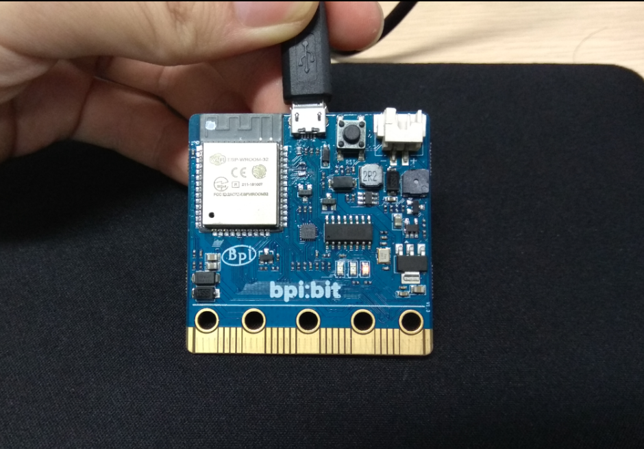
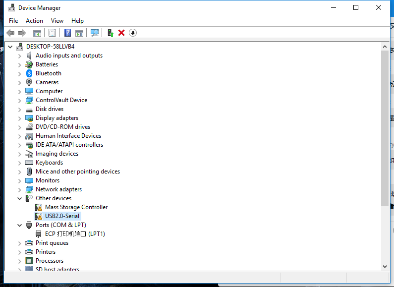
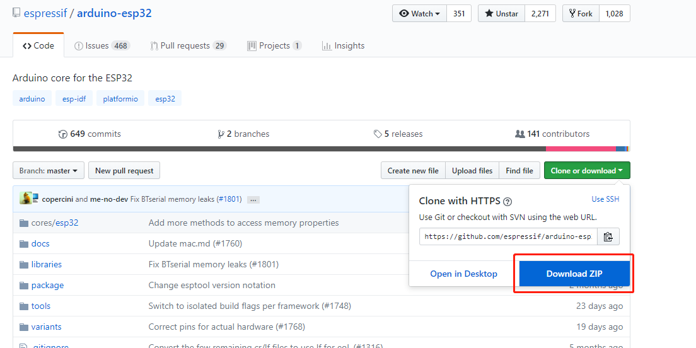
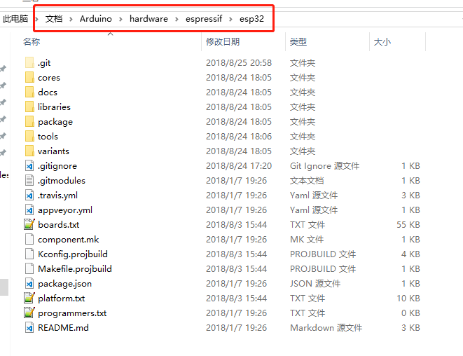
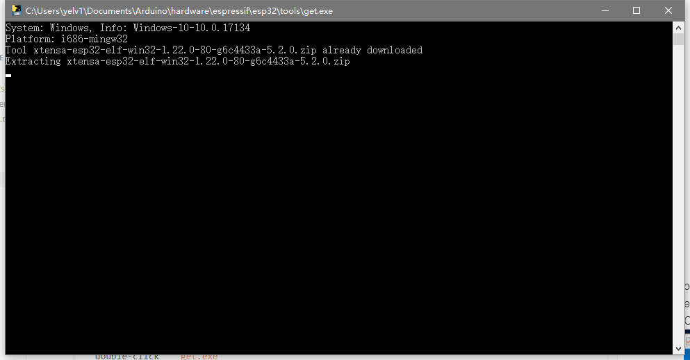
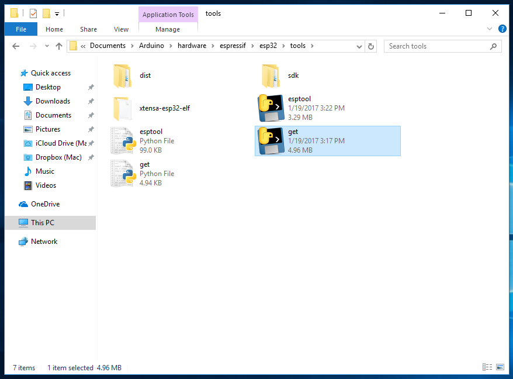
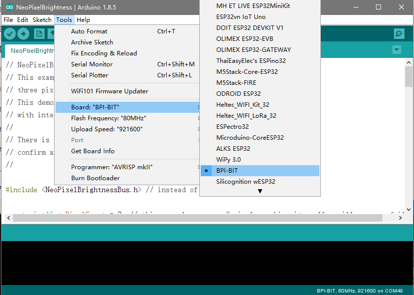

# Arduino

## Arduino IDE 
#### 1. 有线连接板子

- 将板子通过 MicroUSB 线连接到你的电脑里，以下以 Windows10 为例。

 

#### 2. 查看驱动

- 进入 **设备管理器** 确认串口驱动（Serial）是否安装，进入方法如下。
  - （右键）此电脑 -> 属性 -> **设备管理器**
  - 开始菜单 -> （输入）**设备管理器**
  - 控制面板 -> （搜索）**设备管理器**

 

- 可以看到 设备显示 **USB2.0-Serial** ，说明**未安装驱动**，若此前已安装驱动，可以跳至步骤 5 。


#### 3. 安装驱动

- [点此获取 Serial CH341](http://www.wch.cn/downloads/file/5.html) 驱动，并按如下说明操作安装驱动

- 打开下载的 **CH341SER.ZIP** 压缩包，进入 **CH341SER** 文件夹，打开 **SETUP.EXE**，即可看到如下图。

 

- 点击 **INSTALL** （安装），等待片刻即可完成安装。


#### 4. 确认串口

- 核对板子是否连接成功

 

- 可以看到原来的 **USB2.0-Serial** 消失了，取而代之的是 **USB-SERIAL CH340(COM3)**，这意味着你已经成功安装驱动，并且得到板子串口名称为（**COM3**），你可以通过各种串口工具来查看串口名（COM3）的板子传出的信息。

## 2. 开发扩展包

- [arduino-esp32 开发工具包](https://github.com/espressif/arduino-esp32/archive/master.zip)，点击前边连接获取开发工具包
> - 源自乐鑫(espressif) github 开源项目 [arduino-esp32](https://github.com/espressif/arduino-esp32),后续开发工具包更新推荐使用[GitHub-DeskTop](https://desktop.github.com) 工具随时同步更新套件。


## 3. Windows安装说明

1. 下载并安装最新版本的Arduino IDE， ```Windows Installer``` from [arduino.cc](https://www.arduino.cc/en/Main/Software)
2. 从 [espressif/arduino-esp32](https://github.com/espressif/arduino-esp32)开源项目下载Arduino开发扩展包

    

3. 解压Arduino开发扩展包  ```[ARDUINO_SKETCHBOOK_DIR]/hardware/espressif/esp32```
    
    - ARDUINO_SKETCHBOOK_DIR: 一般情况下是 ```C:/Users/[YOUR_USER_NAME]/Documents/Arduino``` 并列在Arduino首选项中的“Sketchbook位置”下方。
        
        

    - 依次打开目录 ```[ARDUINO_SKETCHBOOK_DIR]/hardware/espressif/esp32/tools``` 并且双击运行 ```get.exe```
        
        

    - 当 ```get.exe``` 运行结束, 您应该在目录中看到以下文件

        

4. 插入BPI：BIT板并等待驱动程序安装（或手动安装） [Serial CH341](http://www.wch.cn/downloads/file/5.html) 
5. 运行 `Arduino IDE`
6. 选择您的版型(BPI-BIT) ```Tools > Board``` menu

    

7. 选择BIT板所连接的COM端口，例如`COMx`
8. 编译并上传您的工程代码 (BIT板设计有自动烧录电路，直接点击上传即可)

    

## 3. Debian / Ubuntu OS安装说明

- 从 [arduino.cc](https://www.arduino.cc/en/Main/Software)网站获取并安装最新版本的 Arduino IDE
- 打开终端并执行以下命令 (copy-> paste并点击回车):

  ```bash
  sudo usermod -a -G dialout $USER && \
  sudo apt-get install git && \
  wget https://bootstrap.pypa.io/get-pip.py && \
  sudo python get-pip.py && \
  sudo pip install pyserial && \
  mkdir -p ~/Arduino/hardware/espressif && \
  cd ~/Arduino/hardware/espressif && \
  git clone https://github.com/espressif/arduino-esp32.git esp32 && \
  cd esp32 && \
  git submodule update --init --recursive && \
  cd tools && \
  python2 get.py
  ```
- 重新运行 Arduino IDE

- 如果您已经安装arduino至`~/`目录，请执行以下代码, 如果没有, 那么请从 `mkdir -p ~/Arduino/hardware`开始:

  ```bash
  cd ~/Arduino/hardware
  mkdir -p espressif && \
  cd espressif && \
  git clone https://github.com/espressif/arduino-esp32.git esp32 && \
  cd esp32 && \
  git submodule update --init --recursive && \
  cd tools && \
  python2 get.py
  ```

## 3. Mac OS安装说明

- 从 [arduino.cc](https://www.arduino.cc/en/Main/Software)网站获取并安装最新版本的 Arduino IDE
- 打开终端并执行以下命令 (copy-> paste并点击回车):

  ```bash
  mkdir -p ~/Documents/Arduino/hardware/espressif && \
  cd ~/Documents/Arduino/hardware/espressif && \
  git clone https://github.com/espressif/arduino-esp32.git esp32 && \
  cd esp32 && \
  git submodule update --init --recursive && \
  cd tools && \
  python get.py 
  ```
  其中 `~/Documents/Arduino` 目录与"Arduino" > "首选项" > "Sketchbook location" (在软件启动后)应该保持一致。 如果有需要的话，或许需要更改上面的命令！
  
- 如果您收到以下错误。 使用xcode-select --install安装命令行开发工具并再次尝试上面的命令：

  ```xcrun: error: invalid active developer path (/Library/Developer/CommandLineTools), missing xcrun at: /Library/Developer/CommandLineTools/usr/bin/xcrun```
  
  ```xcode-select --install```
  
- 在运行 `python get.py`的时候，收到错误提示: `IOError: [Errno socket error] [SSL: TLSV1_ALERT_PROTOCOL_VERSION] tlsv1 alert protocol version (_ssl.c:590)` ，您可以尝试使用 `python3` 代替 `python` 

- 重启 Arduino IDE