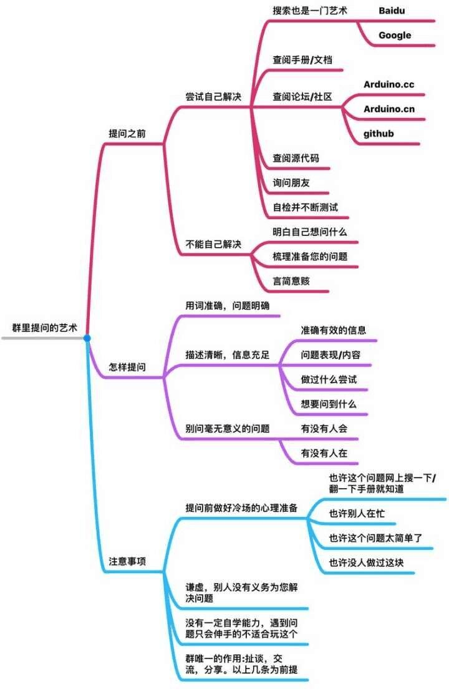

# 社区宗旨

以 bpi-bit 和 bpi-uno 为切入点，提供扎实可靠的开源技术支持服务，试图共建一个良好的编程社区环境。

# 入门流程

根据 项目导航 ，找到自己想要的资料，如果没有找到，路人发 [issues](https://github.com/BPI-STEAM/bpi-bit-development/issues) ，组织中的开发者到 [projects](https://github.com/BPI-STEAM/bpi-bit-development/projects) 中记录收集问题或需求，欢迎你也与我们一同参与这份事业。

## 如何开始？

1. 拿到硬件

2. 查看导航

3. 试图实现

4. 发现问题

5. 提出问题

# 社区导航

[本家论坛](https://forum.banana-pi.org.cn/c/bpi-bit)

更多内容，正在筹备中，如项目中的存在的一些文件，将会分散导航，目前急需各位的参与与建设，任何问题或建议都可以提出，无论多小都可以。

按难易程度来看，可划分为 Wedbuino、MicroPython、Arduino、ESP-IDF，如果是完全没有接触过硬件编程的同学，建议先从 Webduino 开始了解一些物联网基础，它面向的是 网页开发者 和 少儿 STEAM 编程，如果是有过硬件编程基础的则建议使用 MicroPython 进行学习，但如果你觉得这些都太简单了，不妨直接使用 Arduino 或 ESP-IDF 来进行开发。

## [Hardware](hardware.md)

此处将记载所有和硬件有关的介绍，包括原理图或是硬件上的外设 datasheet 等等。

## [Wedbuino](webduino.md)

此处将记载所有和 Webduino 编程有关的介绍，包括前端少儿积木编程用例、或者是开发云端积木，服务器托管程序等等。

## [MicroPython](micropython.md)

此处将记载所有和 MicroPython 编程有关的介绍，包括使用 IDE 开发工具、或者是使用 Scratch3 积木，快速应用硬件外设驱动、开发硬件传感器驱动，甚至是修改和开发底层固件等等。

## [Arduino](arduino.md) 

此处将记载所有和 Arduino 编程有关的介绍，包括使用 IDE 开发工具、编译和自定义硬件程序等等。

## [ESP-IDF](esp-idf.md)

深入底层の专业开发。

# QQ 交流群

## BPI-STEAM (662087773)

官方答疑群，在这群你可以提问或讨论任何有关 bpi:bit 和 bpi:uno 的事情，当然也包括 esp32 和 esp8266 的任何问题。

## Web of Things（892523077）

官方开发群，如果你也想成为我们的一员，共同建设开源事业，欢迎加入。

## MicroPython中文群（541341988）
和 www.micropython.org.cn 共同致力于 Python 在嵌入式方面开发的推广。

## Banana Pi创客社区（85785523）
涵盖了各种 linux 与 嵌入式开发领域的专业爱好者交流的社区。

# 提问の艺术

