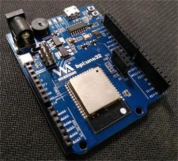

# &emsp;&emsp;&emsp;&emsp;&emsp;&emsp;&emsp;&emsp;BPI 开源社区计划📋

> - 此处为组织发布开发计划地点，快速进入我们的面壁计划 [TODO](todo.md) 。
> - 社区计划会将陆续整理内容出来，逐步形成社区应用导航，并将开发成果发布在 [中文社区](https://forum.banana-pi.org.cn/c/bpi-bit) 供大家所用。

## 社区宗旨

以 bpi-uno 和 bpi-bit 为切入点，提供扎实可靠的开源技术支持服务，试图共建一个良好的编程社区环境。

 

## 社区契合度

只要你，对前沿开源技术充满了兴趣

只要你，想学会底层嵌入式开发技术

只要你，已不满足软件上实现的功能

### 你是否想成为以下的一员？

- 拥有动手能力小发明家

- 新时代炫酷技术创客

- STEAM 教育的先行者

- 硬件产品开发经理

- 专业嵌入式开发者

- 创造价值的英雄人物

### 这里可以给你带来什么？

我们，专注在开源硬件技术支持上。

只要是应用于业界前沿的开发技术，我们都会参与研发。

在这里你可以进行

- Linux
- Windows
- 物联网
- 互联网
- 客户端
- 服务器
- 网页开发
- 硬件设计
- 脚本开发
- STEAM 教育
- Scratch 3.0
- Blockly
- NodeJS
- MicroPython
- Arduino
- ESP-IDF

等各种黑科技技术的开发与讨论。

只要你勤于问，就会有答案。

如果你没有硬件，也想参与，那么这里也会因为你的热情，将硬件免费赠予你。

### 而你需要做什么？

学会提问 期望解决的事情；

学会找到 自己喜欢的东西；

学会分享 自己创造的成果；

学会讨论 与他人一同开发；

然后，成为一个🐂🍺的人。

## 入门流程

### 找准定位

按这个步骤开始，拿到硬件、查看导航、尝试使用、发现问题、提出问题。

#### 如果你是初学者

继续往下看，有问题就发 [issues](https://github.com/BPI-STEAM/bpi-bit-development/issues) 。

#### 如果你是开发者

直接看看我们的 [TODO](todo.md) 吧。

### 学会提问

## 社区导航

### [官方社区](https://forum.banana-pi.org.cn/c/bpi-bit)

按难易程度来看，可划分为 Wedbuino、MicroPython、Arduino、ESP-IDF，如果是完全没有接触过硬件编程的同学，建议先从 Webduino 开始了解一些物联网基础，它面向的是 网页开发者 和 少儿 STEAM 编程，如果是有过硬件编程基础的则建议使用 MicroPython 进行学习，但如果你觉得这些都太简单了，不妨直接使用 Arduino 或 ESP-IDF 来进行开发。

### [Hardware](https://github.com/BPI-STEAM/BPI-BIT-Hardware)

此处将记载所有和硬件有关的介绍，包括产品介绍、驱动安装、硬件原理图或是硬件上的外设 datasheet 等等。

### [Wedbuino](https://github.com/BPI-STEAM/BPI-BIT-Webduino)

此处将记载所有和 Webduino 编程有关的介绍，包括前端少儿积木编程用例、或者是开发云端积木，服务器托管程序等等。

### [MicroPython](https://github.com/BPI-STEAM/BPI-BIT-MicroPython)

此处将记载所有和 MicroPython 编程有关的介绍，包括使用 IDE 开发工具、或者是使用 Scratch3 积木，快速应用硬件外设驱动、开发硬件传感器驱动，甚至是修改和开发底层固件等等。

### [Arduino](https://github.com/BPI-STEAM/BPI-BIT-Arduino)

此处将记载所有和 Arduino 编程有关的介绍，包括使用 IDE 开发工具、编译和自定义硬件程序等等。

## 交流社区（或群）

### BPI-STEAM (QQ 群 662087773)

官方答疑群，在这群你可以提问或讨论任何有关 bpi:bit 和 bpi:uno 的事情，当然也包括 esp32 和 esp8266 的任何问题。

### Web of Things（QQ 群 892523077）

官方开发群，如果你也想成为我们的一员，共同建设开源事业，欢迎加入。

### MicroPython中文群（QQ 群 541341988）

和 www.micropython.org.cn 共同致力于 Python 在嵌入式方面开发的推广。

### Banana Pi 创客社区（QQ 群 85785523）

涵盖了各种 linux 与 嵌入式开发领域的专业爱好者交流的社区。

### [官方中文社区](https://forum.banana-pi.org.cn/c/bpi-bit)

### [万物积木化社区](https://forums.codelab.club/)

### [MicroPython中文社区](https://www.micropython.org.cn)

还有很多，非常欢迎各路爱好者添加。

## 开发者共识

为了能够更好的发展社区，我们将通过以下方法

第一，社区反馈收集问题

第二，路人反馈收集问题

接着在反馈后收集的问题基础上，我们进行开发计划的准备。

确认完成了开发记录后，我们将根据开发计划，直到导出文档，并将此文档记录在导航中，同步发贴回社区，此时才算是完成了开发任务。

注意，任何收集的问题，最好有原话截图，或者是提问记录，如果未来收集的问题很多，则根据投票计划，选择是否列入开发计划。

## 开源贡献者名单

[人员名单 与 任务归档](member_list.md)

